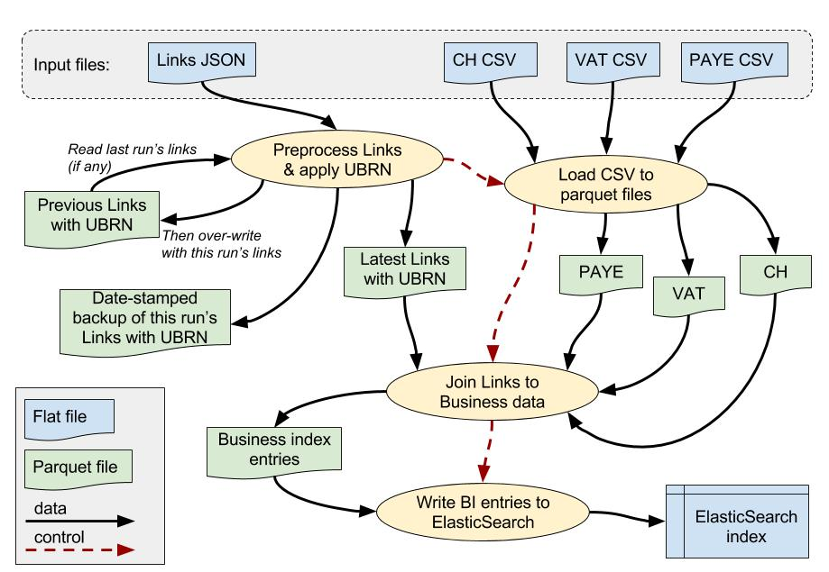

# ONS Business Indexes - data ingestion ##
 



## Purpose ##

* This application performs the data ingestion stage of the ONS Business Index data-flow.
* Source data files are received on a monthly basis.
* These are then processed by a separate machine learning application which attempts to match data for a given business from the different sources i.e. Companies House, HMRC/PAYE, HMRC/VAT.
* The ML process generates a file of possible links (currently in JSON format). 
* The data ingestion process consumes the links and source data files and generates corresponding entries for an ElasticSearch index of businesses.
* The ElasticSearch index is used by a separate application to support queries for business data.
* See [step 0 processing](./docs/bi-dataload-step-0.md) for more information on pre-processing and UBRN allocation for Links data.
* See [step 1 processing](./docs/bi-dataload-step-1.md) for more information on business data sources and initial data-load.

## Platform ##

### Cloudera Hadoop ###

* The ONS Cloudera cluster was mandated as the core platform for the BI data ingestion process.
* This application uses the following components:

> * Apache Spark (currently version 2.2.0)
> * HDFS
> * Hue browser interface
> * Oozie
> * Oozie/Spark action template

* Application code and supporting libraries are held as JAR files in HDFS.
* This allows Oozie to access the code without having to install it on specific nodes within the cluster.

### Spark 2.2.0 ###

* We use Apache Spark for all the Cloudera-based processing.
* Spark provides well-integrated tools for reading, processing and storing data on a distributed platform, such as Hadoop.
* Parquet files are used for interim storage, as Parquet is optimised for performance and Spark can make intelligent use of this format.
* The Spark CSV package is used for reading the source CSV files.
* Spark CSV was provided separately for Spark 1.6.0, but is now included in the default installation of Spark 2.x.

### Scala 2.11 ###

* Apache Spark 2.2.0 on Cloudera is compiled for Scala 2.11.
* This means we also need to use Scala 2.11 for our application.
* Since the Cloudera Spark installation has been upgraded to Spark 2.x, we have re-compiled the Scala code with Scala 2.11, which is the default Scala version for Spark 2.x.
* This was updated by changing the Scala version in the `build.sbt` file.

### ElasticSearch 5.6.x ###

* We are currently using an ElasticSearch cluster which was at version 2.3 but has recently been upgraded to version 5.6.
* This required an upgrade of the ElasticSearch/Spark jar to version 20_2.11-6.0.0.
* So far we haven't needed to change the usage of the ES/Spark API library.

### Additional libraries ###

* We use a couple of extra Scala and Java libraries.
* Since upgrading to Spark 2.x we no longer need the additional Spark CSV jars

* ElasticSearch Spark API:

> * `elasticsearch-spark-20_2.11-6.0.0.jar`

* Typesafe jar for config functions

> * `config-1.3.2.jar`

* These are provided as JARs at runtime (see individual steps below for more information).
* See the `build.sbt` file for Maven/SBT artifact details.

## Building the application ##

* Build the application using SBT from the command-line:

> `sbt clean compile package`

* We use the SBT `package` task, not `assembly`, because we do not want to build a fat JAR here.
* Cloudera has its own installation of Spark, so we do not want to deploy our application with all the Spark libraries.
* It can be difficult to build an assembly package without introducing conflicts between the various Spark libraries and their dependencies.
* The easiest option is to just build the basic package here, then providing the extra JARS as `--jars` dependencies at runtime.

## Configuration ##

* This application uses a typical Scala configuration file:

> [`src/main/resources/application.conf`](./src/main/resources/application.conf)

* This contains the settings for ElasticSearch, file locations etc.
* All the configuration properties can also be specified at runtime, as described in the configuration file.

### Changing configuration settings at runtime ###

* The config file provides a default value for each parameter.
* It also allows the property to be overridden via a specified env variable if provided.
* The environment variable is named like this:

> * e.g. config property:   `bi-dataload.es.index`
> * corresponding variable: `BI_DATALOAD_ES_INDEX`

* So you can override config values at runtime:

> * via command-line Java driver options (e.g. in Oozie):

```
	spark2-submit --class com.example.Sparky 
	             --master local[*] 
	             --driver-java-options "-Dbi-dataload.es.index=my_index_name" 
	 target/scala-2.11/spark-dummy_2.11-1.0.jar
```

> * via a corresponding environment variable such as `BI_DATALOAD_ES_INDEX`.

* See the [config file](./src/main/resources/application.conf) for the individual parameters and corresponding environment variable names.
 

### Priority of config values ###

1.  If value is provided via **Java driver option**, then this value will be used.
2.  Else if value is provided via **env variable**, then this value will be used.
3.  Else if no env or driver value exists, then **value from config file** will be used.


## Deploying the application ##

* The initial implementation is deployed manually.
* The application JAR and the 3rd party library JARs are all placed in a directory in HDFS that can be accessed by Oozie.
* Data files are also stored in HDFS.
* The data file names and locations are specified in `application.conf`, but can be provided at runtime via "-D" parameters.
* The application is executed as a 4-step Oozie workflow.
* The individual steps and their Oozie task parameters are documented separately below.


## Data file locations ##

* All files are held in HDFS.
* The locations are specified via various configuration properties.
* These have default values in the `src/main/resources/application.conf` file.
* They can be modified via environment variables as described above.


## Further information ##

* [README](../README.md)

> * [File locations](./docs/bi-dataload-file-locations.md).
> * [Step 0](./docs/bi-dataload-step-0.md).
> * [Step 1](./docs/bi-dataload-step-1.md).
> * [Step 2](./docs/bi-dataload-step-2.md).
> * [Step 3](./docs/bi-dataload-step-3.md).
> * [Testing](./docs/bi-dataload-testing.md).
> * [CSV extract](./bi-dataload-csv-extract.md).

