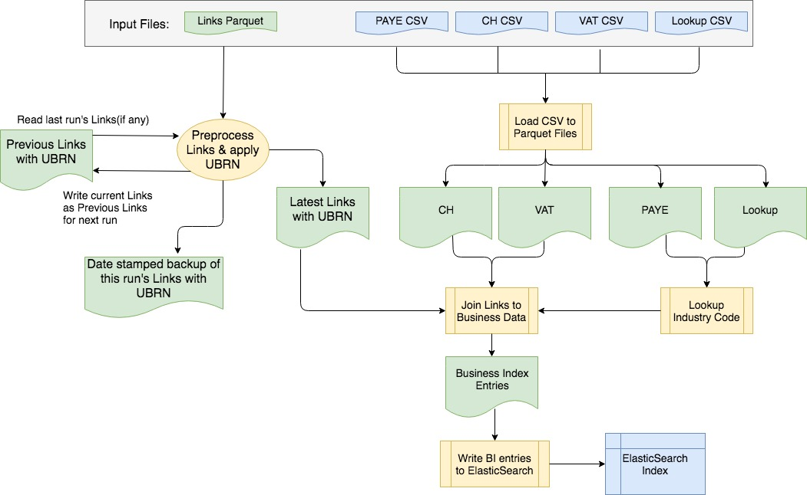

# BI Dataload File locations #

## Follow the data



## Input files ##

### External data ###

* ONS regards HMRC and Companies House files as "external" data.
* The HMRC data (PAYE and VAT) will be extracted in CSV format from the IDBR database that ONS currently maintains.
* Companies House data will be downloaded in CSV format from the CH website e.g. on a monthly basis.
* These "external" data files will be stored in a fixed location in HDFS and may be shared between several applications:

```
    /external
       |
       +-- hmrc
       |     +--- paye
       |     +--- vat
       +-- companiesHouse
```

### Links input data ###

* The Business Indexes data science component will generate a file of linked businesses in JSON format.

> `{"CH":["COMPANYNO"],"VAT":["VATREFERENCE"],"PAYE":["PAYEREFERENCE"]}`
  
* In theory, there could be several VAT or PAYE entries for a given UBRN.
* We expect there only to be ONE Company for each UBRN i.e. there is no real need for the "CH" field to be a list here.
* This Links JSON file will be stored in a different location from the other input files:

```
/ons.gov
    |
    +-- businessIndex
           |
           +-- links:  contains Links JSON file 
           |
           +-- [... see below ]
```

## Application data ##

* This application consists of a data-pipeline that needs to process different data-sets at different stages of the overall data flow.
* In order to maintain this process more easily, it is broken into multiple steps.
* Each step may produce interim data files that will be used in subsequent steps.
* These working files are over-written in each run through the pipeline.
* The mandated directory structure also requires us to have separate directories for `dev`, `test` and `beta` (production) files.

```
/ons.gov
    |
    +-- businessIndex
           |
           +-- links:  contains Links JSON file (see above)
           |
           +-- [dev or test or beta]
                |
                +-- WORKINGDATA: Parquet files
                |
                +-- PREVIOUS: Parquet file of Links with UBRNs from previous run                         
                       |            
                       +-- 201703131145: backup of Links with UBRNs on given date/time.
```


## Further information ##

* [README](../README.md)

> * [File locations](./bi-dataload-file-locations.md).
> * [Step 0](./bi-dataload-step-0.md).
> * [Step 1](./bi-dataload-step-1.md).
> * [Step 2](./bi-dataload-step-2.md).
> * [Step 3](./bi-dataload-step-3.md).
