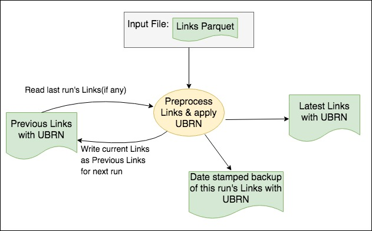

# BI Dataload step 0: pre-process Links #




## Links data (from data science) ##

* Links will be generated by the data science process and provided in a nested JSON format like this:

> `{"CH":["COMPANYNO"],"VAT":["VATREFERENCE"],"PAYE":["PAYEREFERENCE"]}`
  
* In theory, there could be several VAT or PAYE entries for a given UBRN.
* We expect there only to be ONE Company for each UBRN i.e. there is no real need for the "CH" field to be a list here.

## UBRN allocation ##

### What is the UBRN for? ###

* The UBRN is intended to be a unique reference number that will apply to a given set of linked business records i.e. each Link generated from the data science process should have its own UBRN.
* It should be a unique numeric value provided from a sequence.
* It should also be consistent over time i.e. if the same Link appears in a subsequent run of the BI ingestion process, it should receive the original UBRN, not a new one.
* The intention is that end users would in future use the UBRN to identify the business data they are interested in.
* There are no specific user requirements for the UBRN, so the management and use of this value may change in future.

### Challenges for UBRN generation ###

* The BI data ingestion process runs on a distributed Cloudera/HDFS/Spark platform.
* This creates challenges for generating the sequence value, compared to the relatively straightforward mechanisms avalable on a non-distributed platform (such as a database sequence on Oracle RDBMS).
* It is not practical to generate a unique contiguous sequence number on a distributed platform, because at any given time the system cannot be sure that a sequence value generated on one node has not already been used by a process running on another node.

### Generating the UBRN ###

* We have implemented a work-around using Apache Spark's "**monotonically increasing ID**" generator.
* This works by generating a unique value which is partly determined by the specific server node it is running on (it is similar to a standard UUID in this respect).
* This means that the system knows that each node has its own sub-set of sequence numbers, so it only needs to ensure the new value is unique on the relevant node.
* The drawback is that this creates very high sequence values from the outset.
* We get around this by re-partitioning the Link data onto a single node prior to generating the sequence numbers.
* We then allocate the UBRN to the data on a single node, which forces the sequence into a single range of values.
* After allocating the UBRN, we re-partition the data across multiple partitions again to allow more efficient subsequent processing.
* This approach creates a bottle-neck in our data-processing, but seems like the only practical way to meet the apparent requirement for the UBRN currently.

## Month 1 processing (March-April 2017) ##

* The first time we run the monthly data-load, we will be working with a completely fresh set of Links provided by the Data Science process.
* There will be no data for any previous month's run.
* We therefore assume we can allocate UBRNs freely, without worrying about clashing with any previous values because there are no previous values.
* So the month 1 process is:

> * Read the incoming Links JSON file into Spark. 
> * Pass the data through our UBRN allocation process.
> * Write the data to a Links Parquet file.

* The Links Parquet file will be processed further by a later step in the overall BI data ingestion pipeline.


## Month 2+ processing ##

* When we load subsequent sets of Links from the data science process, we will try to match any Links that have already been loaded previously.
* This will involve looking at the Links wth UBRNs that have been loaded previously.
* There will be business rules to determine whether a link should re-use an existing UBRN, or be allocated a fresh UBRN.
* The new UBRN will be generated from a "monotonically increasing ID" (see above), but this starts from zero every time you run it.
* In order to ensure new UBRNs do not duplicate existing ones, we also fetch the maximum previous UBRN prior to running this process, then add this as an offset to the new UBRN to give us what should be a unique new UBRN.

> `new UBRN = max UBRN from previous run + new sequence ID + 1`

* Each run's Links will **replace the existing Links in the ElasticSearch index** i.e. we **do not retain old Links data**  from one run to the next.

### Previous Links files ###

* See [File locations](./bi-dataload-file-locations.md).
* Every time we run the data ingestion process, we generate a new file of Links with UBRNs (in Parquet format).
* This file is saved into the application working directory, as it will be used in subsequent steps in the data ingestion process.
* It is also saved to the "PREVIOUS" folder, ready to be picked up as the "previous links" for the next run.
* This over-writes the "previous links" file from the last run.
* The new Links file is also saved in a time-stamped folder under the "PREVIOUS" folder, so we always have a back-up of the Links with UBRNs for a given run.

### UBRN and Links comparisons ###

#### Current partial implementation (May 2017) ####

* The current data ingestion process (May 2017) applies simplified business rules for checking whether a new Link matches a Link from the previous run.

```
	IF (old CH IS NOT NULL AND new CH IS NOT NULL)
	AND (old CH = new.CH)
	THEN
	  use old UBRN for new Link record
	ELSIF (old CH IS NULL AND new CH IS NULL)
	AND (old contents = new contents)
	THEN
	  use old UBRN for new Link record
	ELSE
	  allocate new UBRN
	END IF
	
```

* This approach allows us to identify large sets of matching Links relatively quickly.
* The remaining Links may need to be checked further if more refined business matching rules are required.
* However, this implementation should cover the vast majority of Link matches from one run to the next.

#### Full implementation (pending) ####

* We defined a full set of rules for UBRN matching and implemented these in April-May 2017.
* However, these require us to use SQL features that are provided via Spark's HiveContext, not the basic SQLContext.
* There are problems running this code via Oozie on our current Cloudera platform.
* We have been advised to upgrade our Cloudera installation, which will also move us to Spark version 2.x.
* We are waiting for this to be done, so that we can modify our code accordingly and reinstate the full set of UBRN rules.

```
	IF (old CH IS NOT NULL AND new CH IS NOT NULL)
	AND (old CH = new CH)
	THEN
	  use old UBRN for new Link record
	ELSIF (old CH IS NULL AND new CH IS NULL)
	AND (old contents = new contents)
	THEN
	  use old UBRN for new Link record
	ELSIF (old VAT = new VAT)
	THEN
	  use old UBRN for new Link record
	ELSIF (old PAYE = new PAYE)
	THEN
	  use old UBRN for new Link record 
	ELSE
	  allocate new UBRN
	END IF
```
#### Applying UBRN rules ####

* Each matching rule is applied in turn via Apark SQL queries using the same basic logic:


* We separate the matched records at each stage and only pass the **unmatched** records into the next matching rule.


* After applying all the rules, any remaining new Link records are allocated a new UBRN as described previously.
* The combined set of new Link records with UBRNs is then assembled and saved to HDFS.


## Running step 0 ##

### Oozie task specification ###

* We use Oozie to execute the Spark processing on Cloudera.
* Each step is defined as a separate task in the work-flow.
* Step 0 should be defined as indicated below.

#### Oozie Task Definition ####

* Assumes files are installed in HDFS `hdfs://dev4/ons.gov/businessIndex/lib`.
* This example specifies 6 Spark executors to ensure sufficient resources when loading the JSON file, as JSON-processing and Link-matching are both quite demanding.
* It may be possible to tweak the various Spark memory settings to use less memory, but this configuration seems to work OK with current data-sets.
* We set the "env" parameter below so the Spark process knows where to read/write application data:

>	`-Dbi-dataload.app-data.env=dev`

* The default value in the config file is "dev", but the parameter is included here to remind you that you may need to change it.
* Set the JAR file to point to the current version of the packaged application.
* The task parameters below also assume we are working in "dev" here.

Page 1 Field | Contents
------------- | -------------
Spark Master  | yarn-cluster
Mode  | cluster
App Name | ONS BI Dataload Pre-process Links
Jars/py files | hdfs://dev4/ons.gov/businessIndex/dev/lib/business-index-dataload_2.10-1.4.jar
Main class | uk.gov.ons.bi.dataload.PreprocessLinksApp

Page 2 Field | Contents
------------- | -------------
Properties / Options list | --num-executors 6 --driver-memory 3G --executor-memory 3G --driver-java-options "-Dbi-dataload.app-data.env=dev -Xms1g -Xmx5g"

## Further information ##

* [README](../README.md)

> * [File locations](./bi-dataload-file-locations.md).
> * [Step 0](./bi-dataload-step-0.md).
> * [Step 1](./bi-dataload-step-1.md).
> * [Step 2](./bi-dataload-step-2.md).
> * [Step 3](./bi-dataload-step-3.md).
> * [Testing](./bi-dataload-testing.md).
> * [CSV extract](./bi-dataload-csv-extract.md).

