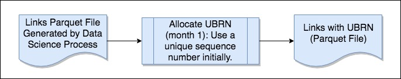

# BI Dataload step 0: pre-process Links #

* [README](../README.md)

> * [Step 0](./bi-dataload-step-0.md).
> * [Step 1](./bi-dataload-step-1.md).
> * [Step 2](./bi-dataload-step-2.md).
> * [Step 3](./bi-dataload-step-3.md).

## Links data (from data science)##

* Links will be generated by the data science process and provided in a nested JSON format like this:

> `{"CH":["COMPANYNO"],"VAT":["VATREFERENCE"],"PAYE":["PAYEREFERENCE"]}`
  
* In theory, there could be several VAT or PAYE entries for a given UBRN.
* We expect there only to be ONE Company for each UBRN i.e. there is no real need for the "CH" field to be a list here.

## UBRN allocation ##

### What is the UBRN for? ###

* The UBRN is intended to be a unique reference number that will apply to a given set of linked business records i.e. each Link generated from the data science process should have its own UBRN.
* It should be a unique numeric value provided from a sequence.
* It should also be consistent over time i.e. if the same Link appears in a subsequent run of the BI ingestion process, it should receive the oiriginal UBRN, not a new one.
* The intention is that end users would in future use the UBRN to identify the business data they are interested in.
* There are no specific user requirements for the UBRN, so the management and use of this value may change in future.

### Challenges for UBRN generation ###

* The BI data ingestion process runs on a distributed Cloudera/HDFS/Spark platform.
* This creates challenges for generating the sequence value, compared to the relatively straightforward mechanisms avalable on a non-distributed platform (such as a database sequence on Oracle RDBMS).
* It is not practical to generate a unique contiguous sequence number on a distributed platform, because at any given time the system cannot be sure that a sequence value generated on one node has not already been used by a process running on another node.

### Generating the UBRN ###

* We have implemented a work-around using Apache Spark's "monotonically increasing ID" generator.
* This works by generating a unique value which is partly determined by the specific server node it is running on (it is similar to a standard UUID in this respect).
* This means that the system knows that each node has its own sub-set of sequence numbers, so it only needs to ensure the new value is unique on the relevant node.
* The drawback is that this creates very high sequence values from the outset.
* We get around this by re-partitioning the Link data onto a single node prior to generating the sequence numbers.
* We then allocate the UBRN to the data on a single node, which forces the sequence into a single range of values.
* After allocating the UBRN, we re-partition the data across multiple partitions again to allow more efficient subsequent processing.
* This approach creates a bottle-neck in our data-processing, but seems like the only practical way to meet the apparent requirement for the UBRN currently.

## Month 1 processing (March-April 2017) ##

* The first time we run the monthly data-load, we will be working with a completely fresh set of Links provided by the Data Science process.
* There will be no data for any previous month's run.
* We therefore assume we can allocate UBRNs freely, without worrying about clashing with any previous values because there are no previous values.
* So the month 1 process is:

>> * Read the incoming Links JSON file into Spark. 
>> * Pass the data through our UBRN allocation process.
>> * Write the data to a Links Parquet file.

* The Links Parquet file will be processed further by a later step in the overall BI data ingestion pipeline.

## Month 2+ processing (NOT YET IMPLEMENTED) ##

* The plan is that when we load subsequent sets of Links from the data science process, we will try to match any Links that have already been loaded previously.
* This will involve looking at the Links wth UBRNs that have been loaded previously.
* There will be business rules to determine whether a link should re-use an existing UBRN, or be allocated a fresh UBRN.
* It is not currently clear how or where the old Links data will be stored, but presumably it will be held somewhere in HDFS.
* **Further work is required here to identify the detailed requirements and design an appropriate solution**.

## Running step 0 ##

### Oozie task specification ###

* We use Oozie to execute the Spark processing on Cloudera.
* Each step is defined as a separate task in the work-flow.
* Step 0 should be defined as indicated below.

#### Oozie Task Definition ####

* Assumes files are installed in HDFS `hdfs://dev4/user/appUser`.
* This example specifies 6 Spark executors to ensure sufficient resources when loading the JSON file, as JSON-processing is quite demanding.
* It may be possible to tweak the various Spark memory settings to use less memory, but this configuration seems to work OK with current data-sets.

Page 1 Field | Contents
------------- | -------------
Spark Master  | yarn-cluster
Mode  | cluster
App Name | ONS BI Dataload 1.1 Step 0 Pre-process Links
Jars/py files | hdfs://dev4/user/appUser/libs/business-index-dataload_2.10-1.1.jar
Main class | uk.gov.ons.bi.dataload.PreprocessLinksApp

Page 2 Field | Contents
------------- | -------------
Properties / Options list | --num-executors 6 --driver-memory 3G --executor-memory 3G --driver-java-options "-Xms1g -Xmx5g"

