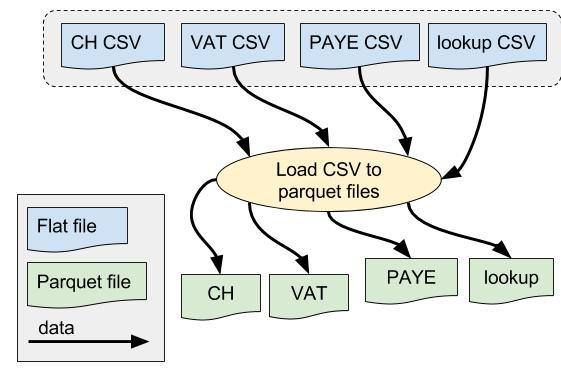

# BI Dataload step 1: convert business data to Parquet files #

## Why? ##

* Initially, the application will consume data in different text-based formats.
* PAYE and VAT data will be provided via CSV extracts from the IDBR.
* Companies House data will be provided from the monthly CSV extract from the Companies House website.
* We will be processing the data with Apache Spark on Cloudera.
* Spark can process Parquet files much more flexibly and efficiently than raw CSV or JSON data.
* Also, the incoming data formats may change.
* We convert the incoming files to Parquet as a first step, so that we can perform subsequent processing steps more efficiently.
* Any lookup data, e.g. PAYE TCN (STC) code --> SIC code conversion, will be provided as CSV files and loaded in the same way here.

### Links data pre-processed separately ###

* Links between CH and PAYE/VAT data are provided as a JSON file which is generated from a separate machine learning application.
* However, Links require extra pre-processing which is performed in [step 0](./bi-dataload-step-0.md).
* We do not process Links data in step 1.

## How? ##

### Data file locations ###

* All files are held in HDFS.
* The locations are specified via various configuration properties.
* These have default values in the `src/main/resources/application.conf` file.
* The configuration properties can be modified at runtime via Java driver properties.
* See the [file locations document](./bi-dataload-file-locations.md) for details.

### Data formats ###

* VAT and PAYE data is currently provided in a CSV format generated from the IDBR.
* Companies House data is provided in a [publicly available CSV format](http://resources.companieshouse.gov.uk/toolsToHelp/pdf/freeDataProductDataset.pdf).
* We copy ALL fields from the source data and store them in the corresponding Parquet files.
* Parquet files hold their data schema, and store data in a compressed columnar format.
* This means subsequent processing steps can select specific columns much more efficiently without having to load the entire data-set e.g. for joining the Links to CH/PAYE/VAT data in [step 2](./bi-dataload-step-2.md).

#### Column headings ####

* We want to use Spark SQL and data-frames wherever possible for processing this data.
* This is easier if our column names meet SQL standards for column identifiers.
* Several of the CSV columns (e.g. for Companies House) include dots and spaces which cause problems in SQL.
* We therefore remove dots and spaces from the column headings during the CSV upload process.
* For example CH column `SICCode.SicText_1` is re-named as `SICCodeSicText_1`.
* You may need to check these conversions if the CSV file formats change.
 
### Spark CSV ###

* This step uses the popular Spark CSV package for parsing and loading data from CSV files directly into Spark's DataFrame format.
* In Spark 2.x, this package is part of the standard Spark installation, so there is no need to install it separately.
* However, our Cloudera cluster is currently on Apache Spark 1.6.0, so we need to load the Spark CSV package and its dependencies separately.
* The corresponding JAR files must be specified at runtime.

> * `spark-csv_2.10-1.5.0.jar`: Spark CSV package
> * `commons-csv-1.1.jar`: Additional dependency for Spark CSV
> * `univocity-parsers-1.5.1.jar`: Additional dependency for Spark CSV

* The JARS should be stored in HDFS so that they can be loaded by the Oozie job at runtime.
* If Spark is upgraded to version 2.x on Cloudera, these libraries will no longer be required.

### Oozie task specification ###

* We use Oozie to execute the Spark processing on Cloudera.
* Each step is defined as a separate task in the work-flow.
* Step 1 should be defined as indicated below.

#### Oozie Task Definition ####

* Assumes JAR files are installed in HDFS `hdfs://dev4/ons.gov/businessIndex/lib`.
* It may be possible to tweak the various Spark memory settings to use less memory, but this configuration seems to work OK with current data-sets.
* We set the "env" parameter below so the Spark process knows where to read/write application data:

>	`-Dbi-dataload.app-data.env=dev`

* The default value in the config file is "dev", but the parameter is included here to  remind you that you may need to change it.
* The task parameters below also assume we are working in "dev" here.

Page 1 Field | Contents
------------- | -------------
Spark Master  | yarn-cluster
Mode  | cluster
App Name | ONS BI Dataload Step 1 Load Source Data To Parquet
Jars/py files | hdfs://dev4/ons.gov/businessIndex/dev/lib/business-index-dataload_2.10-1.4.jar
Main class | uk.gov.ons.bi.dataload.SourceDataToParquetApp

Page 2 Field | Contents
------------- | -------------
Properties / Options list | --num-executors 8 --driver-memory 2G --executor-memory 3G --jars hdfs://dev4/ons.gov/businessIndex/dev/lib/spark-csv_2.10-1.5.0.jar,hdfs://dev4/ons.gov/businessIndex/dev/lib/univocity-parsers-1.5.1.jar,hdfs://dev4/ons.gov/businessIndex/dev/lib/commons-csv-1.1.jar --driver-java-options "-Dbi-dataload.app-data.env=dev -Xms1g -Xmx5g"

## Further information ##

* [README](../README.md)

> * [File locations](./bi-dataload-file-locations.md).
> * [Step 0](./bi-dataload-step-0.md).
> * [Step 1](./bi-dataload-step-1.md).
> * [Step 2](./bi-dataload-step-2.md).
> * [Step 3](./bi-dataload-step-3.md).
> * [Testing](./bi-dataload-testing.md).
> * [CSV extract](./bi-dataload-csv-extract.md).

