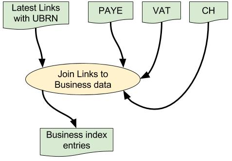

# BI Dataload step 2: lookups for building Business Index entries #

## Overall data flow ##

## What and why? ##

* This step reads the Parquet files of source data i.e. Companies House, PAYE and VAT.
* It also reads the Parquet file of Links with UBRNs.
* It joins the Links to the corresponding CH/PAYE/VAT data and builds the corresponding Business Index entry.
* The Business Index entries are then written to a Parquet file.
* This allows us to separate the initial raw data-load in [step 1](./bi-dataload-step-1.md) from the more complicated processing needed to join the different data-sets and extract the required information.
* The BI entries are written to a Parquet file so we can explore the data if necessary using Python Spark notebooks e.g. for investigating errors or validating the generated data.
* The BI entries will be uploaded to ElasticSearch in [step 3](./bi-dataload-step-3.md).

## How? ##

### Data file locations ###

* All files are held in HDFS.
* The locations are specified via various configuration properties.
* See [file locations](./bi-dataload-step-1.md) for further information.
* The Parquet files are all stored in the specified Parquet working data directory.

### Data formats ###

* Parquet files hold their data schema and store data in an indexed and compressed columnar format.
* This means Spark can select specific columns much more efficiently without having to load the entire data-set e.g. for joining the Links to CH/PAYE/VAT data.
* The output Parquet file of Business Index entries contains only those fields that will be uploaded into ElasticSearch in [step 3](./bi-dataload-step-3.md).
 

## Further information ##

* [README](../README.md)

> * [File locations](./bi-dataload-file-locations.md).
> * [Step 0](./bi-dataload-step-0.md).
> * [Step 1](./bi-dataload-step-1.md).
> * [Step 2](./bi-dataload-step-2.md).
> * [Step 3](./bi-dataload-step-3.md).
> * [Testing](./bi-dataload-testing.md).
