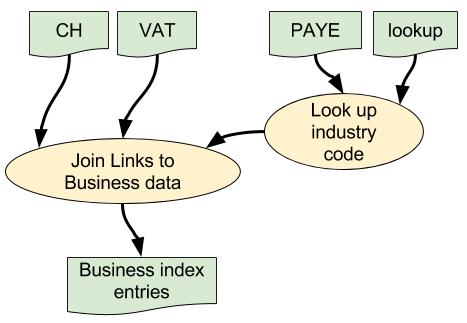
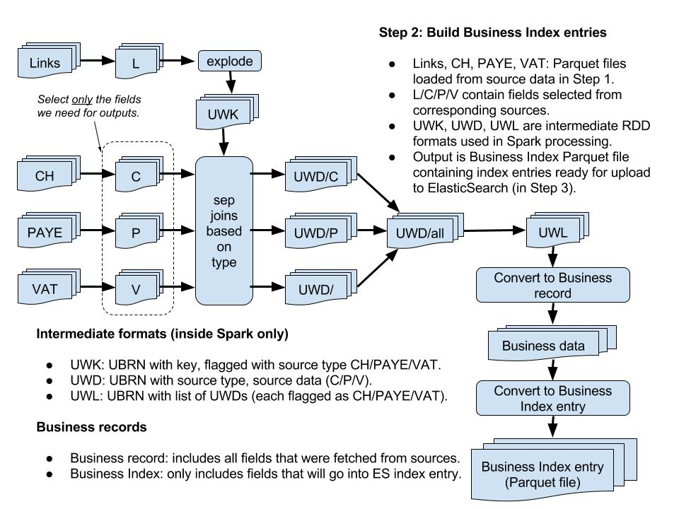

# BI Dataload step 2: build Business Index entries #

## Overall data flow ##

## Detailed processing ##

## What and why? ##

* This step reads the Parquet files of source data i.e. Companies House, PAYE and VAT.
* It also reads the Parquet file of Links with UBRNs.
* It joins the Links to the corresponding CH/PAYE/VAT data and builds the corresponding Business Index entry.
* The Business Index entries are then written to a Parquet file.
* This allows us to separate the initial raw data-load in [step 1](./bi-dataload-step-1.md) from the more complicated processing needed to join the different data-sets and extract the required information.
* The BI entries are written to a Parquet file so we can explore the data if necessary using Python Spark notebooks e.g. for investigating errors or validating the generated data.
* The BI entries will be uploaded to ElasticSearch in [step 3](./bi-dataload-step-3.md).

## How? ##

### Data file locations ###

* All files are held in HDFS.
* The locations are specified via various configuration properties.
* See [file locations](./bi-dataload-step-1.md) for further information.
* The Parquet files are all stored in the specified Parquet working data directory.

### Data formats ###

* Parquet files hold their data schema and store data in an indexed and compressed columnar format.
* This means Spark can select specific columns much more efficiently without having to load the entire data-set e.g. for joining the Links to CH/PAYE/VAT data.
* The output Parquet file of Business Index entries contains only those fields that will be uploaded into ElasticSearch in [step 3](./bi-dataload-step-3.md).
 
### Oozie task specification ###

* We use Oozie to execute the Spark processing on Cloudera.
* Each step is defined as a separate task in the work-flow.
* Step 2 should be defined as indicated below.

#### Oozie Task Definition ####

* Assumes files are installed in HDFS `hdfs://dev4/ons.gov/businessIndex/lib`.
* This example specifies 8 Spark executors to ensure sufficient resources when performing the joins on large data-sets.
* It may be possible to tweak the various Spark memory settings to use less memory, but this configuration seems to work OK with current data-sets.
* We set the "env" parameter below so the Spark process knows where to read/write application data:

>	`-Dbi-dataload.app-data.env=dev`

* The default value in the config file is "dev", but the parameter is included here to  remind you that you may need to change it.

Page 1 Field | Contents
------------- | -------------
Spark Master  | yarn-cluster
Mode  | cluster
App Name | ONS BI Dataload Step 2 Build BI Entries From Links And Business Data
Jars/py files | hdfs://dev4/ons.gov/businessIndex/lib/business-index-dataload_2.10-1.2.jar
Main class | uk.gov.ons.bi.dataload.LinkDataApp

Page 2 Field | Contents
------------- | -------------
Properties / Options list | --driver-memory 4G --num-executors 8 --executor-memory 3G --driver-java-options "-Dbi-dataload.app-data.env=dev -Xms1g -Xmx6g"

## Further information ##

* [README](../README.md)

> * [File locations](./bi-dataload-file-locations.md).
> * [Step 0](./bi-dataload-step-0.md).
> * [Step 1](./bi-dataload-step-1.md).
> * [Step 2](./bi-dataload-step-2.md).
> * [Step 3](./bi-dataload-step-3.md).
