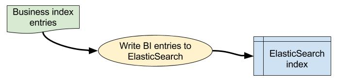

# BI Dataload step 3: upload Business Index entries to ElasticSearch #

## What? ##

* This step reads a single Parquet file of Business Index entries that was generated in [Step 2](./bi-dataload-step-2.md).
* It then uploads the BI entries to the specified index in ElasticSearch.

## How? ##

### Data file locations ###

* The Parquet files are all stored in a specified working data directory
* See [file locations](./bi-dataload-file-locations.md) for details.

### ElasticSearch processing ###

* This step uses the ElasticSearch Spark API.
* This library needs to be provided as a JAR file at runtime.

> * `elasticsearch-spark_2.10-2.4.4.jar`

* The JAR should be stored in HDFS so that it can be loaded by the Oozie job at runtime.
* The ElasticSearch node IP address and index name are specified via configuration parameters.
* These can be provided to the Oozie task at runtime:

> `-Dbi-dataload.es.index=bi-dev -Dbi-dataload.es.nodes=127.0.0.1`
 
* These values are used by the ElasticSearch Spark API when writing to the ES index.
* If the target index does not exist, it can be created automatically here, but the auto-created version will not provide all the required search/index functionality.
* For this reason, the **production version of the index must be created separately before the data is loaded into it**.

### Oozie task specification ###

* We use Oozie to execute the Spark processing on Cloudera.
* Each step is defined as a separate task in the work-flow.
* Step 3 should be defined as indicated below.

#### Oozie Task Definition ####

* Assumes files are installed in HDFS `hdfs://dev4/ons.gov/businessIndex/lib`.
* Performance may depend on ElasticSearch cluster resources which are outside the scope of this application.
* This example specifies 8 Spark executors.
* It may be possible to tweak the various Spark settings to use less memory etc, but this configuration seems to work OK with current data-sets.
* We set the "env" parameter below so the Spark process knows where to read/write application data:

>	`-Dbi-dataload.app-data.env=dev`

* The default value in the config file is "dev", but the parameter is included here to remind you that you may need to change it.
* The task parameters below also assume we are working in "dev" here.

Page 1 Field | Contents
------------- | -------------
Spark Master  | yarn-cluster
Mode  | cluster
App Name | ONS BI Dataload Step 3 Upload to ElasticSearch
Jars/py files | hdfs://dev4/ons.gov/businessIndex/dev/lib/business-index-dataload_2.10-1.2.jar
Main class | uk.gov.ons.bi.dataload.LoadBiToEsApp

Page 2 Field | Contents
------------- | -------------
Properties / Options list | --driver-memory 4G --num-executors 8 --executor-memory 3G --jars hdfs://dev4/ons.gov/businessIndex/dev/lib/elasticsearch-spark_2.10-2.4.4.jar --driver-java-options "-Dbi-dataload.app-data.env=dev -Xms1g -Xmx4g -Dbi-dataload.es.index=bi-dev -Dbi-dataload.es.nodes=127.0.0.1"

## Further information ##

* [README](../README.md)

> * [File locations](./bi-dataload-file-locations.md).
> * [Step 0](./bi-dataload-step-0.md).
> * [Step 1](./bi-dataload-step-1.md).
> * [Step 2](./bi-dataload-step-2.md).
> * [Step 3](./bi-dataload-step-3.md).
> * [Testing](./bi-dataload-testing.md).
> * [CSV extract](./bi-dataload-csv-extract.md).

